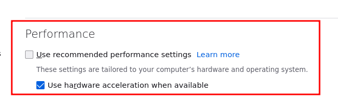

# Firefox
Bastille template to bootstrap Firefox.

## Description

When applied to a container, this template will install with dependencies
 
- firefox 
- noto fonts ( All the glyphs for the modern web )
- xauth
- mesa-dri ( 3D Support if available )
- add user `firefox` 
- gives access to `/tmp/.X11-unix/:0`  from inside the jail.

To run the jailed firefox from the host system please visit 
[jailfox-install](https://github.com/ddowse/jailfox-install) for further instructions.

## Bootstrap
```shell
bastille bootstrap https://github.com/ddowse/jailfox 
```

## Apply
```shell
bastille template TARGET ddowse/jailfox [ --arg WITH_USB=1 ] [ --arg WITH_3D=1  ]
```
The arguments `WITH_3D` and `WITH_USB` are stricly optional. But if you decide
to use them. You have add some rules to `/etc/devfs.rules`, some rules that i
have found working are listed in the `devfs.rules` file in this repo.   
Add the content of `devfs.rules` to your existing `/etc/devfs.rules`.

```sh
[bastille_jail=99]
add include $devfsrules_hide_all
add include $devfsrules_unhide_basic
add include $devfsrules_unhide_login

# Remove comments in the next 2 lines to allow access to soundcard
#add path 'mixer*' unhide
#add path 'dsp*'   unhide

# Remove comments in the next 2 lines to allow access to Webcam
#add path 'cuse*'  unhide
#add path 'video'  unhide

# Remove comments in the next 5 lines to allow access to Videocard for 3D
#add path 'dri'    unhide
#add path 'dri/*'  unhide 
#add path 'drm'    unhide
#add path 'drm/*'  unhide
#add path 'pci'    unhide

# Remove comments in the next 2 lines to allow access to USB devices.
# Mandatory if Webcam and Headset is connected via USB 
#add path 'usb'    unhide
#add path 'usb/*'  unhide
```

```shell
bastille config TARGET set devfs_rules 99
service devfs restart
bastille restart TARGET
```

## 3D Acceleration 

Settings -> Scroll down Uncheck "Use recommended performance settings".   



Open `about:config` and `set gfx.webrender.all` to `true`

Restart Firefox

## Hint

To avoid frustration, i recommend to snapshot the target jail before applying
the template.   This way makes it easy to rollback if you want to start fresh jail.
You could also create a snapshot of the target jail, after the template is
applied, to always have a fresh webbrowser at your disposal.

And feedback on this template is welcome. 
